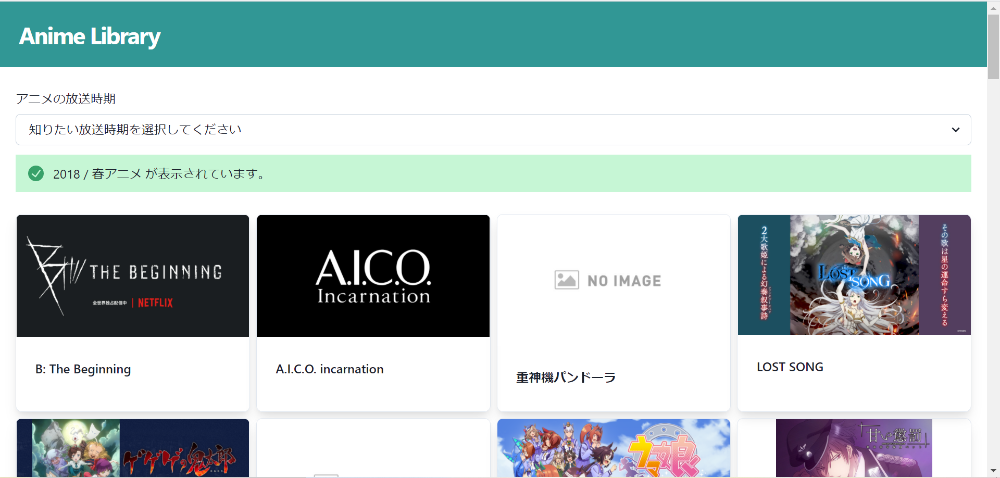

## Anime Library

## 詳細

フロントエンド => nginx,React

バックエンド => Python,flask,uwsgi

## 使い方

### インストールするもの

- node
- Docker

### 手順

1. `cd frontend/my-app`のコマンドで my-app ディレクトリに移動
2. `yarn install`を実行
3. `yarn build`を実行
4. `cd ..`,`cd ..`を実行し、最初の階層に移動。
5. `docker compose up --build`を実行
